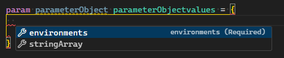
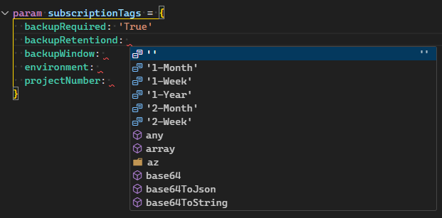
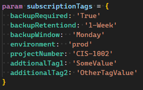

+++
author = "Kevin Oliver"
title = "Working with User-Defined Types in Bicep"
date = "2023-10-20T13:57:01.161Z"
draft = false
description = "Understanding the power of User-Define Types in Bicep"
tags = [ "Bicep", "Infrastructure as Code" ]
lastmod = "2022-10-08T22:33:02.994Z"
slug = "working-user-defined-types-bicep"
+++

### User Defined Types in Bicep
The Bicep team continues to deliver new features and functionality with each release of Bicep. Many of these new features are first released in an [experimental state](https://learn.microsoft.com/en-us/azure/azure-resource-manager/bicep/bicep-config#enable-experimental-features) to allow customers to begin testing and provide feedback early in the development process. 
User-Defined Types are a feature I have been looking forward to for a long time. As of a recent release of Bicep [v0.21.1](https://github.com/Azure/bicep/releases/tag/v0.21.1), this feature is now generally available! 


## What are User-defined Types
User-Define Types  are a `type` statement that allows us to define custom types in our templates. 
They are defined in a similar way as parameters: 
``` bicep
// parameter 
param <parameter-name> <parameter-data-type> = <default-value>

//user define type
type <user-defined-data-type-name> = <type-expression>
```
In past versions of Bicep you were limited to supported [data types](https://learn.microsoft.com/en-us/azure/azure-resource-manager/bicep/data-types) for parameters (string, integer, boolean, arrays, objects). We can now create custom types to better describe the parameters needed for the deployment. User-Defined types only use the primitive literal types (string, integer, boolean). The real power is how you combine these these to create your custom types. 
``` bicep
// A string type array
type stringArray1 = string[]

// a string with 3 valid options
type stringEnvironments = 'dev' | 'qa' | 'prod'

// A type can use other user-defined types, Here we combine the previous types into 1
type parameterObject = {
  @description('We can also use *some* decorators on our types.')
  stringArray: stringArray1? //adding a ? makes the property optional when using this type
  @description('We can also use *some* decorators on our types')
  environments: stringEnvironments
}

param parameterObject parameterObject

```

Using the User-Define Type provides additional intellisense for that type and any other types that were used in that type.
. 

## Why am I excited about this feature? 

Writing complex objects or arrays in Bicep today is like a guessing game. I can require or use values or properties in parts of the template and **if** these are not documented properly, it increases the difficulty for others using that template. Having to hunt through a Bicep template or readme to find out what values are required in an array or an object can be a blocker to adoption of your template by other teammates. Bicep is amazingly good at providing helpful intellisense to avoid this kind of context switching. The major gap had always been parameter objects and arrays. Let's look at how User-Define Types fill this gap.

### Examples

Let's start with a simple template for creating tags for a subscription. Every subscription should have a set of tags that are required for various teams and compliance reasons. Here is a sample of what the required parameters looked like before user-defined types: 

``` Bicep
// Here is a set of parameters needed to get our required tags
@description('Required. Environment for deployed resources')
@allowed(['dev', 'qa', 'prod'])
param environmentTag string

@description('Required. Project Number for subscription')
param projectNumberTag string

@description('Required. Are backups required for this subscription')
@allowed(['True', 'False'])
param backupRequiredTag string

@description('Optional. backup retention options')
@allowed(['', '1-Week', '2-Week', '1-Month', '2-Month', '1-Year'])
param backupRetentionTag string

@description('Optional. What day for backups to run')
@allowed(['', 'Monday', 'Tuesday', 'Wednesday', 'Thursday', 'Friday', 'Saturday', 'Sunday'])
param backupWindowTag string

@description('Optional. Any additional tags required for this subscription')
param additionalTags object = {}

var requiredSubscriptionTags = {
  environment: environmentTag
  projectNumber: projectNumberTag
  backupRequired: backupRequiredTag
  backupRetention: backupRetentionTag
  backupWindow: backupWindowTag
}

var allsubscriptionTags = union(requiredSubscriptionTags, additionalTags)

```

From a parameter file, I would need to define all 6 parameters and values.  With User-Defined Types we now have more flexibility to define our objects directly. 

Here is a User-Define Type alternative: 

``` Bicep
type subscriptionTagValues = {
  @description('Required. Environment for deployed resources')
  environment: 'dev'| 'qa' | 'prod'
  @description('Required. Project Number for subscription')
  projectNumber: string
  @description('Required. Are backups required for this subscription')
  backupRequired: 'True' | 'False'
  @description('Optional. backup retention options')
  backupRetentiond: ''|'1-Week'|'2-Week'|'1-Month'|'2-Month'|'1-Year'
  @description('Optional. What day for backups to run')
  backupWindow: ''|'Monday'|'Tuesday'|'Wednesday'|'Thursday'|'Friday'|'Saturday'|'Sunday'
  *:string
}

param subscriptionTags subscriptionTagValues

```

The Tag Object contains all of our required tags **and** all the required values and a description of the type property. From our parameter file we get the same intellisense but with a simplified definition of our tag parameter .



An additional benefit of this approach is the ability to add tags that are not defined in the object! The final line of the object, `*:string`, allows the object to take additional undefined properties of the type string. 



At time of writing, you can only add one type (string, int, boolean) for additional properties at a time. This further simplifies our template parameters by removing additional steps.

### Conclusion
User-Define Types help to simplify writing templates by giving us the power to define and document complex parameter objects. No one enjoys having to reverse engineer a template just to implement it. Removing that additional uncertainty of confusion bring template re-usability to the next level. Giving teams the ability to define and describe template parameters without needing to write additional documentation will drive adoption with teammates and co-workers.


