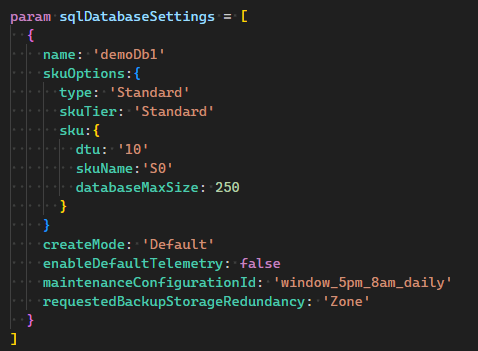

# User Defined Types in Action

After spending a good deal of time working in depth with User Defined Types at the end of 2023, I want to expand the post on the basics of [User Defined Types](../user-define-types/index.md). User Defined Types provide a great new capability as we write Bicep code; it is also a feature that is hard to define it's value until you see it in action. In this post I will walk through an advanced Bicep template I designed to help deploy Azure SQL Databases. This template takes advantage of multiple advanced features and techniques that will bring better understanding and speed to your deployments. 


## Template Scope overview
Before diving into the Bicep template, I want to explain the design of our bicep deployment. There are 2 components to our strategy, modules and templates. 

- Modules - Generalized resource that contain the logic to successfully deploy the resource
- Templates - Contain the business and security requirements for a deployment

Modules are generalized bicep files that target an Azure resource (e.g Azure SQL DM, Azure Virtual Machine, Virtual Network). These modules are designed to allow for deployment in multiple configurations without altering the module. These modules are based on the [Azure Resource Modules](https://github.com/Azure/ResourceModules) project. Utilizing a generalized module allows us to abstract away logic to minimize the complexity of the templates used by teams. This helps to streamline the template that the customer or operations would use. 

An example would be checking if the deployment is using User Assigned Identities, Managed Identities, or none at all. Here is the logic used by the module: 
``` Bicep
var formattedUserAssignedIdentities = reduce(map((managedIdentities.?userAssignedResourcesIds ?? []), (id) => { '${id}': {} }), {}, (cur, next) => union(cur, next)) // Converts the flat array to an object like { '${id1}': {}, '${id2}': {} }

var identity = !empty(managedIdentities) ? {
  type: (managedIdentities.?systemAssigned ?? false) ? (!empty(managedIdentities.?userAssignedResourcesIds ?? {}) ? 'SystemAssigned,UserAssigned' : 'SystemAssigned') : (!empty(managedIdentities.?userAssignedResourcesIds ?? {}) ? 'UserAssigned' : null)
  userAssignedIdentities: !empty(formattedUserAssignedIdentities) ? formattedUserAssignedIdentities : null
} : null
```
This abstraction provides several benefits:
- Template designers are not required to develop complex logic to manage parameter and variable input.
- Template parameters can focused on gather environment specific information.
- Template development can be completed faster and with less complexity. 

The goal of this strategy is to create templates that require minimal complexity to meet the business requirements for the deployment. For example, we have projects that are allowed to host resources with public access, while other projects that have access to on-premise resources are not allowed to have publicly facing resources. The template for public access deployment would have options for public access while the second template would instead require private endpoint parameters. 

Here is an example of template that is used to ensure deployments are not publicly enabled: 
``` Bicep
module sqlServer '../../modules/sql/server/main.bicep' = {
  name: '${sqlServerName}-dp'
  params: {
    name: sqlServerName
    administratorLogin: sqlServerConfiguration.administratorLogin
    administratorLoginPassword: sqlServerConfiguration.administratorLoginPassword
    administrators: sqlServerConfiguration.administrators
    managedIdentities: sqlServerConfiguration.managedIdentitiesType
    location: location
    lock: sqlServerConfiguration.?lock ?? null
    publicNetworkAccess: 'Disabled'
    restrictOutboundNetworkAccess: 'Disabled'
    enableDefaultTelemetry: false
    minimalTlsVersion: '1.2'
```

Properties can be hard coded to ensure the template configuration meet security and business requirements. While it is possible for someone to modify the template during a PR, the expectation is that this change be caught during the review. If it was missed during the review, then the Azure Policy for SQL DB would block the deployment. Having layers of validation is crucial to ensuring proper configuration of your deployments.

### Template components

Let's review the main components of our [template](https://github.com/kevball2/bicep-samples/blob/feat-initial/samples/user-defined-types/complex/templates/sql/server/main.bicep). 

Our template is organized into sections: 
- User Defined Types
- Parameters
- Variables
- Resources
- Modules
- Outputs

Defining a good structure for your templates can ensure consistent development across multiple teams. Defining structure, formatting, and naming standards allow for faster development and review. I highly recommend developing a style guide for the creation of templates and modules.

## User Defined Types

Our template utilizes several user defined types to improve usability and discovery of parameter requirements. These types are imported from several files using the `compileTimeImports` feature: 

``` Bicep
import {
  azureEnvironmentType
  sqlDatabaseSettingType
  sqlServerSettingType
  privateEndpointSubnetType
  convertGigabytesToBytes
} from './types/types.bicep'
```

Types have been moved to their own files to logically encapsulate a portion of the template they each represent.

### Azure Environment Type
The `azureEnvironmentType` contains information specific to our environments and deployments. It provides static information that can be used to dynamically create or complete resources in our template. The `export()` decorator makes the type available for import from another bicep file. 
The `sealed()` decorator prevents modification of the property values to avoid alterations in the parameter file. 
``` Bicep
@description('Azure environment specific configuration settings')
@export()
@sealed()
type azureEnvironmentType = {
  @description('Azure US Government specific settings')
  AzureUSGovernment: {
    @description('Azure Gov Event Hub ResourceIds')
    eventHubName: {
      prod: '<resourceId>'
      qa: '<resourceId>'
      dev: '<resourceId>'
    }
    @description('Azure Gov supported regions')
    region: {
      usgovvirginia: 'ugv'
      usgovtexas: 'ugt'
    }
    @description('Azure Gov Log Analytics ResourceIds')
    workspace: {
      prod:'<resourceId>'
      qa: '<resourceId>'
      dev: '<resourceId>'
    }
    @description('Azure Global Private DNS Zones')
    privateEndpointDns: {
      sql: '<resourceId>'
    }
  }?
  @description('Azure Global specific settings')
  AzureCloud: {
    @description('Azure Global Event Hub ResourceIds')
    eventHubName: {
      prod: '<resourceId>'
      qa: '<resourceId>'
      dev: '<resourceId>'
    }
    @description('Azure Global supported regions')
    region: {
      eastus: 'eus'
      westus: 'wus'
    }
    @description('Azure Global Log Analytics ResourceIds')
    workspace: {
      prod: '<resourceId>'
      qa: '<resourceId>'
      dev: '<resourceId>'
    }
    @description('Azure ECM Global Private DNS Zones')
    privateEndpointDns: {
      #disable-next-line no-hardcoded-env-urls
      sql: '<resourceId>'
    }
  }?
}
``` 


An example of this would be the SQL Server name:

``` Bicep
var sqlServerName = 'sql-${projectName}-${deploymentEnvironment}-${azureEnvironment![environment().name].region[location]}'
```

Another example is the private endpoint DNS zone Resource Id:
``` Bicep
privateEndpoints: [
      {
        subnetResourceId: privateEndpointSubnet.id
        privateDnsZoneResourceIds: [
          azureEnvironment![environment().name].privateEndpointDns.sql
        ]
      }
    ]

```


While this information could also be stored in a variable, providing it as a Type allows us to add helpful descriptions for consumers of the template. The type is also be available from the parameter file. In future iterations of this template, I plan to call this user defined type from a bicep registry to centralize updates of these static properties. Providing a  re-usable type that can be used to retrieve environment static values helps provide a repeatable pattern of access.   

### sqlServerSettingType
This Type contains all the required parameters needed by our template for the SQL Server resource deployment. As I mentioned before, the template focuses on the features of SQL Server for this business case. Ensuring each property has a detailed description helps consumers understand the parameter requirements and options available to them. Our goal is allow consumers to be able to create a new parameter file for a template and complete all the required parameters without reading additional documentation.  

``` Bicep
@export()
type sqlServerSettingType = {
  @description('Optional. Admin user name for SQl server')
  administratorLogin: string?
  @secure()
  @description('Admin Password for SQL Server')
  administratorLoginPassword: string?
  @description(
    'The Azure Active Directory administrator of the server. This can only be used at server create time. If used for server update, it will be ignored or it will result in an error. For updates individual APIs will need to be used.'
  )
  administrators: {
    @description('\'ActiveDirectory\' is currently the only Type available')
    administratorType: 'ActiveDirectory'
    @description('Azure Active Directory only Authentication enabled.')
    azureADOnlyAuthentication: true | false
    @description('Login name of the server administrator.')
    login: string
    @description('Principal Type of the sever administrator')
    principalType: 'Application' | 'Group' | 'User'
    @description('SID (object ID) of the server administrator.')
    sid: string
    @description('Tenant ID of the administrator. AzGov | AzGlobal)
    tenantId: 'AzGovTenantId' | 'AzGlobalTenantId'
  }?
  lock: lockType
  managedIdentitiesType: {
    @description('Optional. Enables system assigned managed identity on the resource.')
    systemAssigned: bool?
    @description('Optional. The resource ID(s) to assign to the resource.')
    userAssignedResourcesIds: string[]?
  }?
}

@export()
@description('Optional. The type of lock to be applied to the resource')
type lockType = {
  @description('Optional. Specify the name of lock.')
  name: string?

  @description('Optional. Specify the type of lock.')
  kind: ('CanNotDelete' | 'ReadOnly' | 'None')?
}?
```

### sqlDatabaseSettingType

This Type defines all the required properties to successfully deploy databases to the SQL server. 

``` Bicep
@export()
@description('Configuration settings for SQL Database Deployment')
type sqlDatabaseSettingType = {
  @description('The name of the database')
  name: string
  @description('The name of the SKU, this value is filtered based on the SKU Tier')
  skuOptions: sqlDatabaseSkuOptions
  @description('The default database collation is SQL_Latin1_General_CP1_CI_AS')
  collation: 'SQL_Latin1_General_CP1_CI_AS'?
  @description('Diagnostic Setting options')
  diagnosticSettings: diagnosticSettingType
  @description('Optional. Whether or not this database is a ledger database, which means all tables in the database are ledger tables. Note: the value of this property cannot be changed after the database has been created.')
  isLedgerOn: bool?
  @description('The license type to apply for this database.')
  licenseType: string?
  @description('Defines the period when the maintenance updates will occur.')
  maintenanceConfigurationId: 'window_5pm_8am_daily' | 'window_10pm_6am_EST_Monday_Thursday' | 'windows_10pm_6am_EST_Friday_Sunday'
  @description('Optional. The name of the sample schema to apply when creating this database.')
  sampleName: string?
  tags: object?
  @description('The Elastic Pools to create with the server.')
  elasticPoolId: string?
  enableDefaultTelemetry: false
  @description(
    'Optional. The storage account type to be used to store backups for this database.'
  )
  requestedBackupStorageRedundancy: 'Local' | 'Zone' | ''
  @description('Optional. The short term backup retention policy to create for the database.')
  backupShortTermRetentionPolicy: object?
  @description('Optional. The long term backup retention policy to create for the database.')
  backupLongTermRetentionPolicy: object?
  @description('''
  Specifies the mode of database creation.
  Default: regular database creation.
  Copy: creates a database as a copy of an existing database. sourceDatabaseId must be specified as the resource ID of the source database.
  Secondary: creates a database as a secondary replica of an existing database. sourceDatabaseId must be specified as the resource ID of the existing primary database.
  PointInTimeRestore: Creates a database by restoring a point in time backup of an existing database. sourceDatabaseId must be specified as the resource ID of the existing database, and restorePointInTime must be specified.
  Recovery: Creates a database by restoring a geo-replicated backup. sourceDatabaseId must be specified as the recoverable database resource ID to restore.
  Restore: Creates a database by restoring a backup of a deleted database. sourceDatabaseId must be specified. If sourceDatabaseId is the database's original resource ID, then sourceDatabaseDeletionDate must be specified. Otherwise sourceDatabaseId must be the restorable dropped database resource ID and sourceDatabaseDeletionDate is ignored. restorePointInTime may also be specified to restore from an earlier point in time.
  RestoreLongTermRetentionBackup: Creates a database by restoring from a long term retention vault. recoveryServicesRecoveryPointResourceId must be specified as the recovery point resource ID.
  Copy, Secondary, and RestoreLongTermRetentionBackup are not supported for DataWarehouse edition.'
  ''')
  createMode: 'Default'

  @description('The resource identifier of the source database associated with create operation of this database.')
  sourceDatabaseResourceId: string?
  @description('Specifies the time that the database was deleted.')
  sourceDatabaseDeletionDate: string?
  @description('The resource identifier of the recovery point associated with create operation of this database.')
  recoveryServicesRecoveryPointResourceId: string?
  @description('Specifies the point in time (ISO8601 format) of the source database that will be restored to create the new database.')
  restorePointInTime: string?
}[]
```
Again good descriptions and simplified options help the consumers of the the template. A good example of this is the `maintenanceConfigurationId` property. This value is unique resource Id per region. From the users perspective, they only need to choose the back up window. 

``` Bicep
@description('Defines the period when the maintenance updates will occur.')
maintenanceConfigurationId: 'window_5pm_8am_daily' | 'window_10pm_6am_EST_Monday_Thursday' | 'windows_10pm_6am_EST_Friday_Sunday'
```

In the template, we take the value provided and replace it with the value needed for the SQL Database deployment. 

``` Bicep
var maintenanceConfigurationId = {
  window_5pm_8am_daily: subscriptionResourceId(
    'Microsoft.Maintenance/publicMaintenanceConfigurations',
    'SQL_Default'
  )
  window_10pm_6am_EST_Monday_Thursday: subscriptionResourceId(
    'Microsoft.Maintenance/publicMaintenanceConfigurations',
    'SQL_${location}_DB_1'
  )
  window_10pm_6am_EST_Friday_Sunday: subscriptionResourceId(
    'Microsoft.Maintenance/publicMaintenanceConfigurations',
    'SQL_${location}_DB_1'
  )
}
```
Providing the consumer of the template with simple options where possible helps to minimize questions and confusion when using your template! 

### sqlDatabaseSkuOptions
Now we get into the complex portion of our template. Generally you provide sku information for SQL Databases through properties such as: 
- skuName
- skuSize
- skuCapacity
- skuFamily

These values align with various tiers of Azure SQL DB:
- DTU 
  - Basic
  - Standard
  - Premium
- vCore
  - General Purpose Provisioned
  - General Purpose Serverless
  
Each of these tiers have different sku's and potentially different features based on your sku choice. Providing a list of options previously was not possible due the complexity and scale of options available. However, now with User Defined Types, we can bring structure to the chaotic assortment of sku's and options.

Below is the top level user defined type that is part of the `sqlDatabaseSettingType`. 

``` Bicep
import { sqlDatabaseSkuBasic, sqlDatabaseSkuStandard, sqlDatabaseSkuPremium } from 'DtuType.bicep'
import { sqlDatabaseSkuGeneralPurposeProvisioned } from 'generalPurposeProvisionedType.bicep'
import { sqlDatabaseSkuGeneralPurposeServerless} from 'generalPurposeServerlessType.bicep'

// SQL SKUs Type
@sealed()
@discriminator('type')
type sqlDatabaseSkuOptions = sqlDatabaseSkuBasic | sqlDatabaseSkuStandard
 | sqlDatabaseSkuPremium | sqlDatabaseSkuGeneralPurposeProvisioned | sqlDatabaseSkuGeneralPurposeServerless
```

While this type appears simple, there is a great deal of logic and configuration hidden under the covers. The `sqlDatabaseSkuOptions` type is a composition of 5 user defined types:
- sqlDatabaseSkuBasic
- sqlDatabaseSkuStandard
- sqlDatabaseSkuPremium
- sqlDatabaseSkuGeneralPurposeProvisioned
- sqlDatabaseSkuGeneralPurposeServerless

This is accomplished using the `@discriminator()` decorator. User defined types can be combined using a shared property. From the [Bicep documentation](https://learn.microsoft.com/en-us/azure/azure-resource-manager/bicep/user-defined-data-types#declare-tagged-union-type): 
> The discriminator decorator takes a single parameter, which represents a shared property name among all union members. This property name must be a required string literal on all members and is case-sensitive. The values of the discriminated property on the union members must be unique in a case-insensitive manner.

For our type, we use the `type` property. This is found on each user defined type. Lets take a look at at the `sqlDatabaseSkuStandard` type:

``` Bicep
@export()
type sqlDatabaseSkuStandard = {
  type: 'Standard'
  skuTier: 'Standard'
  @description('The Standard SKU of the SQL Server you want to deploy.')
  sku: standardDtuType
}
```

For most sku's, there are 2 required properties, `skuTier` and `skuName`. For all the standard sku's the `skuTier` value is **Standard**. The `SkuName` options are: 
- S0, S1, S2, S3, S4, S5, S6, S7, S9, S12 ([Standard Service Tier](https://learn.microsoft.com/en-us/azure/azure-sql/database/resource-limits-dtu-single-databases?view=azuresql#standard-service-tier)). So how do we handle all these sku options? Discriminated Unions to the rescue again! The `sku` property is set to the discriminated type `standardDtuType`:

``` Bicep
// Unioned Type for Standard Skus
@discriminator('dtu')
type standardDtuType = standardDTU10 | standardDTU20 | standardDTU50 | standardDTU100 | standardDTU200
 | standardDTU400 | standardDTU800 | standardDTU1600 | standardDTU3000
```

Each of these Sku's can have different capacities based on the tier such as max DTU and Max Database Storage. To assist consumers of our template, we took the approach of providing relevant information for each sku as part of our User Defined Types. Here is the **standardDTU10** type: 
``` Bicep
type standardDTU10 = {
  @description('database transaction unit (DTU)')
  dtu: '10'
  @description(
    'NOTE: Standard S0, S1 and S2 tiers provide less than one vCore (CPU). For resource-intensive workloads, a service tier of S3 or greater is recommended. '
  )
  skuName: 'S0'
  @maxValue(250)
  @minValue(1)
  @description(
    'Max size for 10 DTUs is 250 GB. Data Storage for S0 uses HDD based storage media best suited for development and testing.'
  )
  databaseMaxSize: 1 | 2 | 5 | 10 | 20 | 30 | 40 | 50 | 100 | 150 | 200 | 250
}
```
The `dtu` property is used as the discriminated property in our `standardDtuType` to combine all of our standard sku's into the `sqlDatabaseSkuOptions` Type. `dtu` was chosen as it best represented the deciding factor most consumers would use, the performance level of the sku. The `skuName` property is the actual value passed to our SQL module to choose the correct sku. `DatabaseMaxSize` is the value passed for the storage capacity of the sku. There are set increments of storage that are allowed for the Standard sku's database size. In our parameter file we would see the DB skuOptions listed like this: 


*possibly add a gif showing the db intellisense options*

As the template consumer fills out their parameter file, they will be provided with options and details that will allow most users to be able to select the proper sku for their database. There some considerations with this approach.

Pros
- Users have convenient access to most required properties to choose a sku.
- Only valid options are presented to the User.
- Option values that are Sku Specific are only displayed for those sku's.

Cons:
- Sku's availability is region specific, some sku's may not be available in all regions
- Testing all sku options can be difficult to automate are part of a CI/CD pipeline.
- For more complex or unique DB deployments, additional guidance may still be needed for Azure Documentation. 

Let's map out our design so far! 

- sqlDatabaseSkuOptions (discriminated('type'))
  - sqlDatabaseSkuBasic
  - sqlDatabaseSkuStandard 
    - type: 'Standard'
    - skuTier: 'Standard'
    - sku: standardDtuType
      - standardDtuType (discriminated('dtu'))
        - standardDTU10
        - standardDTU20
        - standardDTU50
        - standardDTU100
        - standardDTU200
        - standardDTU400
        - standardDTU800
        - standardDTU1600
        - standardDTU3000
  - sqlDatabaseSkuPremium
  - sqlDatabaseSkuGeneralPurposeProvisioned
  - sqlDatabaseSkuGeneralPurposeServerless

This strategy, while complex, provides a huge benefit to consumers of our template. Ensuring users can only choose the required and valid options for their sku increases the success of our template deployment. There is no need to go read additional documentation or question which properties are needed for your chosen sku. By dividing the SQL Database sku's into User Defined Types, we are able to create nested types that contain the sku specific options that are **<u>only</u>** presented when the user chooses that sku. 

To drive the point home, lets look at the GeneralPurposeProvisioned Type:
``` Bicep
@export()
type sqlDatabaseSkuGeneralPurposeProvisioned = {
  type: 'GeneralPurposeProvisioned'
  skuTier: 'GeneralPurpose'
  @description(
    'The General Purpose Provisioned Tier of the SQL Server you want to deploy.'
  )
  sku: generalPurposeProvisionedType
}
@discriminator('vCores')
type generalPurposeProvisionedType = GP_Gen5_2 | GP_Gen5_4 | GP_Gen5_6 | GP_Gen5_8 | GP_Gen5_10
 | GP_Gen5_12 | GP_Gen5_14 | GP_Gen5_16 | GP_Gen5_18 | GP_Gen5_20 | GP_Gen5_24
 | GP_Gen5_32 | GP_Gen5_40 | GP_Gen5_80

@sealed()
type GP_Gen5_2 = {
  @description('General Purpose Provisioned Tier SKU Name')
  skuName: 'GP_Gen5_2'
  @maxValue(1024)
  @minValue(1)
  @description('Max data storage size is 1024 GB')
  databaseMaxSize: int
  @description('2 vCores assigned with SKU GP_Gen5_2 ')
  vCores: '2'
}

```
Instead of using `dtu` this discriminated type uses `vCores` for it's joining type. This again helps the user in deciding which tier to use (vCores begin one of the biggest factors). Each sku type has 3 properties:
- skuName 
- databaseMaxSize
- vCores

Both `skuName` and `databaseMaxSize` are needed for the deployment of the SQL DB, where as `vCores` is only used to provide a user readable convention for choosing the sku they need. `GP_Gen5_2` does not provide a good description for most users. You can also see in this case that the `GP_Gen5_2` type allows any value `databaseMaxSize` instead of set size limits like the Standard Serverless sku we looked at previously. Please continue to investigate the template on my [Github](https://github.com/kevball2/bicep-samples/tree/feat-initial/samples/user-defined-types/complex/templates). Each User Defined Type for each skuTier is slightly different to handle due to specific requirements for that Tier. 


## Conclusion

User Defined Types represent a major change in how we can author Bicep templates and modules. Having the ability to create complex logical types to provide our template easy to digest parameters is a huge win. Removing some of the guess work and confusing parameter requirements from our template and module deployments will go a long way in increasing user adoption. I hope this post has helped you understand the potential of this new feature. 
Happy Coding! 


